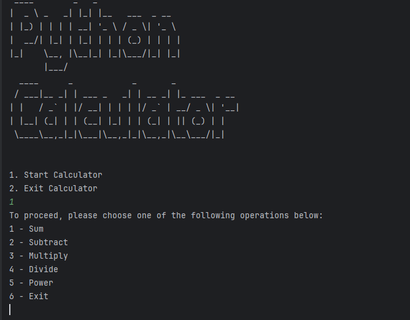

# Simple Calculator
The Simple Caclculator is a console-based application developed using Python, capable of performing the five basic operations:
 - Sum
 - Subtraction
 - Multiplication
 - Division
 - Exponentiation

## Features 
- **Basic arithmetic operations:** addition, subtraction, multiplication, division and exponentiation.
- **Efficient and accurate calculations**
- Ideal for **quick math tasks** and **learning** purposes 

## Modules
### figlet Module
I have used this module to display the text when the calculator is opened as well as when the user exits the calculator. 

# How to run?
- Clone the repository and open it on your favorite IDE.
- After that, just run calculator.py and have fun :)

**Note**: Make sure python is installed locally on your machine, before trying to run it.

## Contributions
Contributions are welcome! If you have suggestions for improvements or bug fixes, feel free to submit a pull request or open an issue in this repository.

